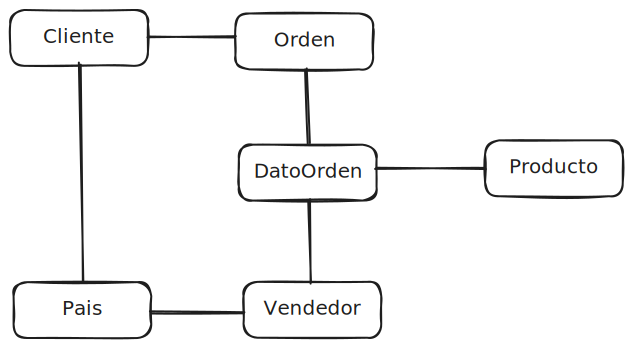
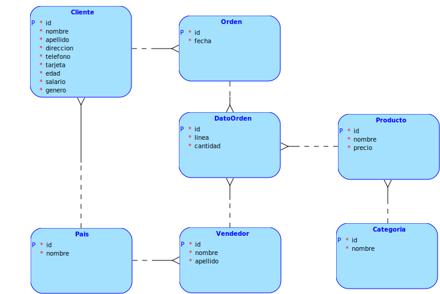
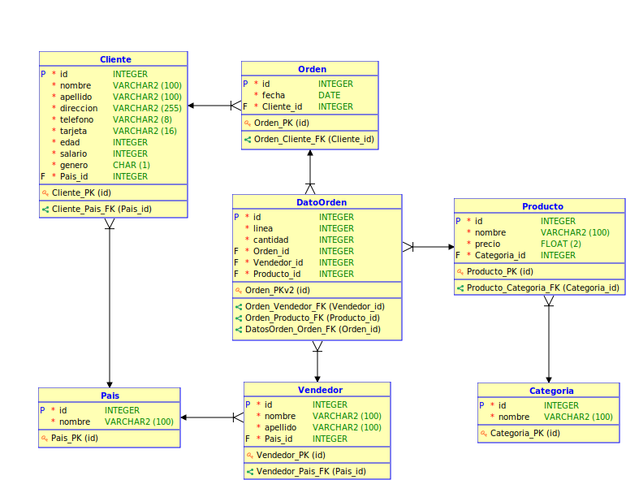

# Proyecto 1 Bases 1 1S 2024

## 201908355 - Danny Hugo Bryan Tejaxún Pichiyá

## Modelos

### **Modelo Conceptual**
  

### **Modelo Logico**
  

### **Modelo Relacional**
  

## Script De La Base De Datos BD1P1
```sql
CREATE TABLE IF NOT EXISTS pais (
    id     INTEGER PRIMARY KEY NOT NULL,
    nombre VARCHAR(100) NOT NULL
);

CREATE TABLE IF NOT EXISTS categoria (
    id     INTEGER PRIMARY KEY NOT NULL,
    nombre VARCHAR(100) NOT NULL
);

CREATE TABLE IF NOT EXISTS cliente (
    id        INTEGER PRIMARY KEY NOT NULL,
    nombre    VARCHAR(100) NOT NULL,
    apellido  VARCHAR(100) NOT NULL,
    direccion VARCHAR(255) NOT NULL,
    telefono  VARCHAR(10) NOT NULL,
    tarjeta   VARCHAR(16) NOT NULL,
    edad      INTEGER NOT NULL,
    salario   INTEGER NOT NULL,
    genero    CHAR(1) NOT NULL,
    pais_id   INTEGER NOT NULL,
    FOREIGN KEY (pais_id) REFERENCES pais(id)
);

CREATE TABLE IF NOT EXISTS orden (
    id          INTEGER PRIMARY KEY NOT NULL,
    fecha       DATE NOT NULL,
    cliente_id  INTEGER NOT NULL,
    FOREIGN KEY (cliente_id) REFERENCES cliente(id)
);

CREATE TABLE IF NOT EXISTS vendedor (
    id       INTEGER PRIMARY KEY NOT NULL,
    nombre   VARCHAR(100) NOT NULL,
    apellido VARCHAR(100) NOT NULL,
    pais_id  INTEGER NOT NULL,
    FOREIGN KEY (pais_id) REFERENCES pais(id)
);

CREATE TABLE IF NOT EXISTS producto (
    id           INTEGER PRIMARY KEY NOT NULL,
    nombre       VARCHAR(100) NOT NULL,
    precio       FLOAT(2) NOT NULL,
    categoria_id INTEGER NOT NULL,
    FOREIGN KEY (categoria_id) REFERENCES categoria(id)
);

CREATE TABLE IF NOT EXISTS datoorden (
    id          INTEGER PRIMARY KEY AUTO_INCREMENT NOT NULL,
    linea       INTEGER NOT NULL,
    cantidad    INTEGER NOT NULL,
    orden_id    INTEGER NOT NULL,
    vendedor_id INTEGER NOT NULL,
    producto_id INTEGER NOT NULL,
    FOREIGN KEY (orden_id) REFERENCES orden(id),
    FOREIGN KEY (vendedor_id) REFERENCES vendedor(id),
    FOREIGN KEY (producto_id) REFERENCES producto(id)
);
```

[Script del Modelo](./Script/BD1P1.sql)  
[Script de Consultas de Manipulación del Modelo](./Script/Querys.sql)  
[Script de Consultas de Información](./Script/Querys1-10.sql)  

## Relaciones

### Lógica Del Modelo
* Cada cliente puede estar vinculado a muchas ordenes de venta.
* Cada orden de venta debe tener vinculado a uno y solo un cliente.
* Cada cliente debe tener uno y solo un pais de origen.
* Cada pais puede tener muchos clientes.
* Cada vendedor debe tener uno y solo un país de origen.
* Cada pais puede tener muchos vendedores.
* Cada vendedor puede estar vinculado a muchos datos de órdenes de venta.
* Cada dato de orden de venta debe tener vinculado uno y solo un vendedor.
* Cada orden de venta puede estar vinculado a muchos datos de órdenes de venta.
* Cada dato de orden de venta debe tener vinculado una y solo una orden de venta.
* Cada producto puede estar vinculado a muchos datos de órdenes de venta.
* Cada dato de orden de venta debe tener vinculado uno y solo un producto.
* Cada producto debe tener una y solo una categoría.
* Cada categoría puede pertenecer a muchos productos.

|     Tablas      |   ```pais```    | ```categoria``` |  ```cliente```  |   ```orden```   | ```vendedor```  | ```producto```  | ```datoorden``` |
| --------------- | :-------------: | :-------------: | :-------------: | :-------------: | :-------------: | :-------------: | :-------------: |
| ```pais```      |                 |                 |  Uno a muchos   |                 |  Uno a muchos   |                 |                 |
| ```categoria``` |                 |                 |                 |                 |                 |  Uno a muchos   |                 |
| ```cliente```   |                 |                 |                 |  Uno a muchos   |                 |                 |                 |
| ```orden```     |                 |                 |                 |                 |                 |                 |  Uno a muchos   |
| ```vendedor```  |                 |                 |                 |                 |                 |                 |  Uno a muchos   |
| ```producto```  |                 |                 |                 |                 |                 |                 |  Uno a muchos   |
| ```datoorden``` |                 |                 |                 |                 |                 |                 |                 |

## Entidades

### Pais
| Campo | Tipo |
| :-: | :-: |
| ```PK``` id  | ```INT``` |
| nombre | ```VARCHAR``` |

### Categoria
| Campo | Tipo |
| :-: | :-: |
| ```PK``` id  | ```INT``` |
| nombre | ```VARCHAR``` |

### Cliente
| Campo | Tipo |
| :-: | :-: |
| ```PK``` id  | ```INT``` |
| nombre | ```VARCHAR``` |
| apellido | ```VARCHAR``` |
| direccion | ```VARCHAR``` |
| telefono | ```VARCHAR``` |
| tarjeta | ```VARCHAR``` |
| edad | ```INT``` |
| salario | ```INT``` |
| genero | ```CHAR``` |
| ```FK``` pais_id | ```INT``` |

### Orden
| Campo | Tipo |
| :-: | :-: |
| ```PK``` id  | ```INT``` |
| fecha | ```DATE``` |
| ```FK``` cliente_id | ```INT``` |

### Vendedor
| Campo | Tipo |
| :-: | :-: |
| ```PK``` id  | ```INT``` |
| nombre | ```VARCHAR``` |
| apellido | ```VARCHAR``` |
| ```FK``` pais_id | ```INT``` |

### Producto
| Campo | Tipo |
| :-: | :-: |
| ```PK``` id  | ```INT``` |
| nombre | ```VARCHAR``` |
| precio | ```FLOAT``` |
| ```FK``` categoria_id | ```INT``` |

### DatoOrden
| Campo | Tipo |
| :-: | :-: |
| ```PK``` id  | ```INT``` |
| linea | ```INT``` |
| cantidad | ```INT``` |
| ```FK``` orden_id | ```INT``` |
| ```FK``` vendedor_id | ```INT``` |
| ```FK``` producto_id | ```INT``` |

## Claves Primarias Y Foráneas

|      Tabla      | Llave Primaria |               Llaves Foráneas                |
| --------------- | :------------: | :------------------------------------------: |
| ```pais```      |  id ```INT```  |                                              |
| ```categoria``` |  id ```INT```  |                                              |
| ```cliente```   |  id ```INT```  | pais_id                            ```INT``` |
| ```orden```     |  id ```INT```  | cliente_id                         ```INT``` |
| ```vendedor```  |  id ```INT```  | pais_id                            ```INT``` |
| ```producto```  |  id ```INT```  | categoria_id                       ```INT``` |
| ```datoorden``` |  id ```INT```  | orden_id, vendedor_id, producto_id ```INT``` |

## Datos De Entrada Provenientes De Archivos CSV

### Ejemplos

#### Paises.csv
```csv
id_pais;nombre
1;Estados Unidos
2;Reino Unido
3;Alemania
4;Francia
```

#### Categorias.csv
```csv
id_categoria;nombre
1;Electrónicos
2;Ropa
3;Hogar
```

#### Clientes.csv
```csv
id_cliente;Nombre;Apellido;Direccion;Telefono;Tarjeta;Edad;Salario;Genero;id_pais
1;John;Doe;123 Main St;12345678;1234567890123456;30;50000.00;M;1
2;Jane;Smith;456 Elm St;87654321;9876543210987654;25;60000.00;F;2
3;Michael;Johnson;789 Oak St;13579246;5678901234567890;35;70000.00;M;3
4;Emily;Williams;101 Pine St;24681357;4321876509876543;28;55000.00;F;4
```

#### Vendedores.csv
```csv
id_vendedor;nombre;id_pais
1;Brodie Macqueen;2
2;Madeleine Samson;4
3;Alexandra Godfrey;1
```

#### Productos.csv
```csv
id_producto;Nombre;Precio;id_categoria
1;Teléfono móvil;500.00;1
2;Camiseta;20.00;2
3;Mesa;150.00;3
```

#### Ordenes.csv
```csv
id_orden;linea_orden;fecha_orden;id_cliente;id_vendedor;id_producto;cantidad
1;1;06/03/2024;2;1;1;1
2;2;07/03/2024;3;2;2;2
3;3;08/03/2024;1;3;3;3
4;1;06/03/2024;1;2;3;1
```

## Normalización

### Forma Normal 1

Para el caso de los archivos de órdenes pueden venir repetidas el número de orden, fecha de orden y el id del cliente en varias órdenes de compra debido a que un mismo cliente puede realizar compras en la misma fecha en la misma compra.

Por lo que se creó la tabla *DatoOrden* en la que se almacena el número de línea, cantidad de productos comprados, el id del producto comprado, id de orden y el id del vendedor.

Mientras que en la tabla *Orden* tiene los campos id de orden, fecha y id de cliente.