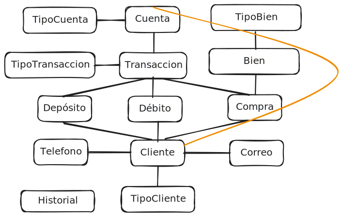
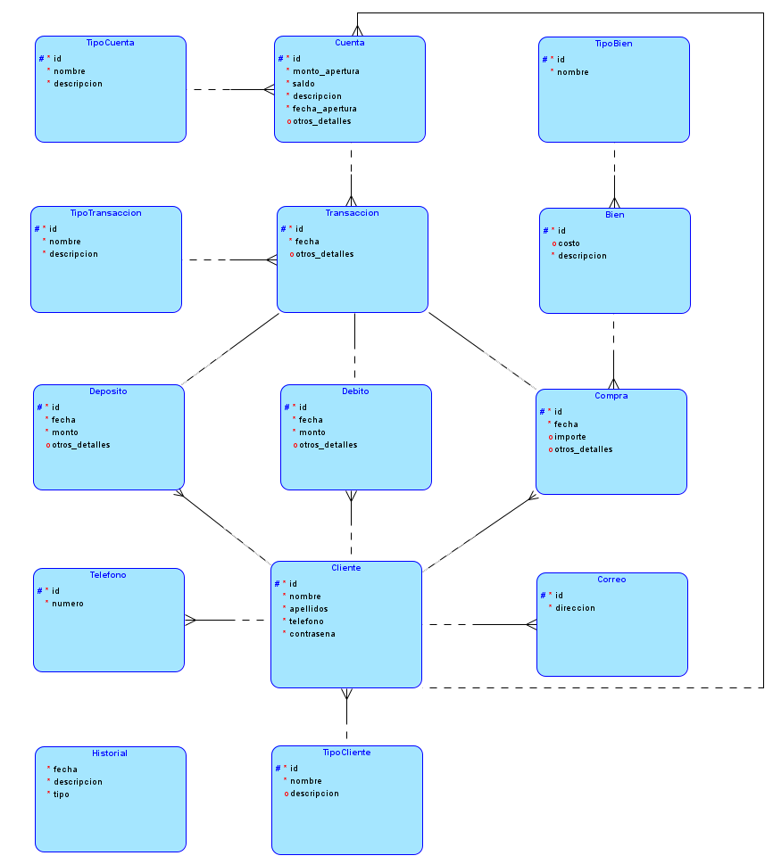

# Proyecto 2 Bases 1 1S 2024

## 201908355 - Danny Hugo Bryan Tejaxún Pichiyá

## Modelos

### **Modelo Conceptual**

### **Modelo Logico**

### **Modelo Relacional**

## Script De La Base De Datos BD1P2

## Relaciones

### Lógica Del Modelo

## Entidades

## Claves Primarias Y Foráneas

## Datos De Entrada