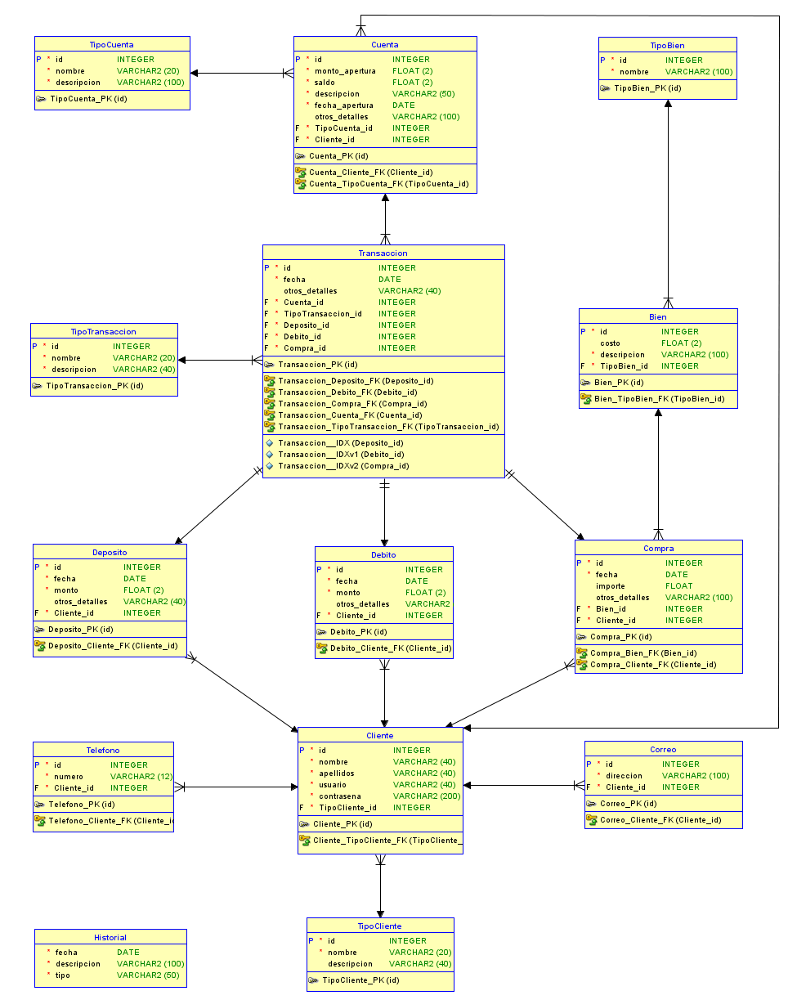

# Proyecto 2 Bases 1 1S 2024

## 201908355 - Danny Hugo Bryan Tejaxún Pichiyá

## Modelos

### **Modelo Conceptual**


### **Modelo Logico**


### **Modelo Relacional**


## Script De La Base De Datos BD1P2
```sql
CREATE TABLE IF NOT EXISTS BD1P2.TipoBien (
    id     INTEGER PRIMARY KEY NOT NULL,
    nombre VARCHAR(100) NOT NULL
);

CREATE TABLE IF NOT EXISTS BD1P2.TipoCliente (
    id          INTEGER PRIMARY KEY AUTO_INCREMENT NOT NULL,
    nombre      VARCHAR(40) NOT NULL,
    descripcion VARCHAR(200)
);

CREATE TABLE IF NOT EXISTS BD1P2.TipoCuenta (
    id          INTEGER PRIMARY KEY AUTO_INCREMENT NOT NULL,
    nombre      VARCHAR(40) NOT NULL,
    descripcion VARCHAR(200) NOT NULL
);

CREATE TABLE IF NOT EXISTS BD1P2.TipoTransaccion (
    id          INTEGER PRIMARY KEY AUTO_INCREMENT NOT NULL,
    nombre      VARCHAR(20) NOT NULL,
    descripcion VARCHAR(40) NOT NULL
);

CREATE TABLE IF NOT EXISTS BD1P2.Bien (
    id          INTEGER PRIMARY KEY NOT NULL,
    costo       FLOAT(2),
    descripcion VARCHAR(100),
    tipobien_id INTEGER NOT NULL,
    FOREIGN KEY (tipobien_id) REFERENCES TipoBien (id)
);

CREATE TABLE IF NOT EXISTS BD1P2.Cliente (
    id             INTEGER PRIMARY KEY NOT NULL,
    nombre         VARCHAR(40) NOT NULL,
    apellidos      VARCHAR(40) NOT NULL,
    usuario        VARCHAR(40) NOT NULL,
    contrasena     VARCHAR(200) NOT NULL,
    fechacreacion  DATE NOT NULL,
    tipocliente_id INTEGER NOT NULL,
    FOREIGN KEY (tipocliente_id) REFERENCES BD1P2.TipoCliente (id)
);

CREATE TABLE IF NOT EXISTS BD1P2.Telefono (
    id         INTEGER PRIMARY KEY AUTO_INCREMENT NOT NULL,
    numero     VARCHAR(12),
    cliente_id INTEGER,
    FOREIGN KEY (cliente_id) REFERENCES BD1P2.Cliente (id)
);

CREATE TABLE IF NOT EXISTS BD1P2.Correo (
    id         INTEGER PRIMARY KEY AUTO_INCREMENT NOT NULL,
    direccion  VARCHAR(100),
    cliente_id INTEGER,
    FOREIGN KEY (cliente_id) REFERENCES BD1P2.Cliente (id)
);

CREATE TABLE IF NOT EXISTS BD1P2.Cuenta (
    id             INTEGER PRIMARY KEY NOT NULL,
    monto_apertura FLOAT(2) NOT NULL,
    saldo          FLOAT(2) NOT NULL,
    descripcion    VARCHAR(255) NOT NULL,
    fecha_apertura DATE NOT NULL,
    otros_detalles VARCHAR(255),
    tipocuenta_id  INTEGER NOT NULL,
    cliente_id     INTEGER NOT NULL,
    FOREIGN KEY (tipocuenta_id) REFERENCES BD1P2.TipoCuenta (id),
    FOREIGN KEY (cliente_id) REFERENCES BD1P2.Cliente (id)
);

CREATE TABLE IF NOT EXISTS BD1P2.Compra (
    id             INTEGER PRIMARY KEY NOT NULL,
    fecha          DATE NOT NULL,
    importe        FLOAT,
    otros_detalles VARCHAR(100),
    bien_id INTEGER NOT NULL,
    cliente_id INTEGER NOT NULL,
    FOREIGN KEY (bien_id) REFERENCES BD1P2.Bien (id),
    FOREIGN KEY (cliente_id) REFERENCES BD1P2.Cliente (id)
);

CREATE TABLE IF NOT EXISTS BD1P2.Debito (
    id             INTEGER PRIMARY KEY NOT NULL,
    fecha          DATE NOT NULL,
    monto          FLOAT(2) NOT NULL,
    otros_detalles VARCHAR(40),
    cliente_id     INTEGER NOT NULL,
    FOREIGN KEY (cliente_id) REFERENCES BD1P2.Cliente (id)
);

CREATE TABLE IF NOT EXISTS BD1P2.Deposito (
    id             INTEGER PRIMARY KEY NOT NULL,
    fecha          DATE NOT NULL,
    monto          FLOAT(2) NOT NULL,
    otros_detalles VARCHAR(40),
    cliente_id     INTEGER NOT NULL,
    FOREIGN KEY (cliente_id) REFERENCES BD1P2.Cliente (id)
);

CREATE TABLE IF NOT EXISTS BD1P2.Transaccion (
    id                 INTEGER PRIMARY KEY AUTO_INCREMENT NOT NULL,
    fecha              DATE NOT NULL,
    otros_detalles     VARCHAR(40),
    cuenta_id          INTEGER NOT NULL,
    tipotransaccion_id INTEGER NOT NULL,
    deposito_id        INTEGER,
    debito_id          INTEGER,
    compra_id          INTEGER,
    FOREIGN KEY (cuenta_id) REFERENCES Cuenta (id),
    FOREIGN KEY (tipotransaccion_id) REFERENCES BD1P2.TipoTransaccion (id),
    FOREIGN KEY (deposito_id) REFERENCES BD1P2.Deposito (id),
    FOREIGN KEY (debito_id) REFERENCES BD1P2.Debito (id),
    FOREIGN KEY (compra_id) REFERENCES BD1P2.Compra (id)
);

CREATE TABLE IF NOT EXISTS BD1P2.Historial (
    fecha       DATETIME NOT NULL,
    descripcion VARCHAR(100),
    tipo        VARCHAR(50)
);
```

[Script del Modelo](./Script/BD1P2.sql)  
[Tipos](./Script/Types.sql)  
[Script de Procedimientos y Funciones de las Funcionalidades](./Script/Procs.sql)  
[Script de Procedimientos y Funciones de los Reportes](./Script/Procs.sql)  
[Triggers](./Script/Triggers.sql)  

## Relaciones

### Lógica Del Modelo
* Cada tipo de cliente puede estar vinculado a muchos clientes.
* Cada cliente debe tener un tipo de cliente.
* Cada cliente puede tener muchos números de teléfono.
* Cada número de teléfono debe estar vinculado a un cliente.
* Cada cliente puede tener muchos correos electrónicos.
* Cada correo electrónico debe estar vinculado a un cliente.
* Cada cliente puede tener muchos depósitos.
* Cada depósito debe estar vinculado a un cliente.
* Cada cliente puede tener muchos débitos.
* Cada débito debe estar vinculado a un cliente.
* Cada cliente puede tener muchas compras.
* Cada compra debe estar vinculada a un cliente.
* Cada depósito puede estar vinculado a una transacción.
* Cada débito puede estar vinculado a una transacción.
* Cada compra puede estar vinculado a una transacción.
* Cada transacción debe estar vinculado a un depósito, débito o compra.
* Cada tipo de transacción puede estar vinculado a muchas transacciones.
* Cada transacción debe tener un tipo de transacción.
* Cada tipo de cuenta puede estar vinculado a muchas cuentas.
* Cada cuenta debe tener un tipo de cuenta.
* Cada tipo de bien (producto o servicio) puede estar vinculado a muchos bienes.
* Cada bien debe tener un tipo de bien (producto o servicio).
* Cada bien puede estar vinculado a muchas compras.
* Cada compra debe tener un bien.
* Cada cliente puede tener muchas cuentas.
* Cada cuenta debe estar vinculada a un cliente.
* Historial no está relacionado.

## Entidades

### TipoBien
| Campo | Tipo |
| :- | :- |
| ```PK``` id  | ```INTEGER``` |
| nombre | ```VARCHAR``` |

### TipoCliente
| Campo | Tipo |
| :- | :- |
| ```PK``` id  | ```INTEGER``` |
| nombre | ```VARCHAR``` |
| descripcion | ```VARCHAR``` |

### TipoCuenta
| Campo | Tipo |
| :- | :- |
| ```PK``` id  | ```INTEGER``` |
| nombre | ```VARCHAR``` |
| descripcion | ```VARCHAR``` |

### TipoTransaccion
| Campo | Tipo |
| :- | :- |
| ```PK``` id  | ```INTEGER``` |
| nombre | ```VARCHAR``` |
| descripcion | ```VARCHAR``` |

### Bien
| Campo | Tipo |
| :- | :- |
| ```PK``` id  | ```INTEGER``` |
| costo | ```FLOAT``` |
| descripcion | ```VARCHAR``` |
| ```FK``` tipobien_id  | ```INTEGER``` |

### Cliente
| Campo | Tipo |
| :- | :- |
| ```PK``` id  | ```INTEGER``` |
| nombre | ```VARCHAR``` |
| apellidos | ```VARCHAR``` |
| usuario | ```VARCHAR``` |
| contrasena | ```VARCHAR``` |
| fechacreacion | ```DATE``` |
| ```FK``` tipocliente_id | ```INTEGER``` |

### Telefono
| Campo | Tipo |
| :- | :- |
| ```PK``` id  | ```INTEGER``` |
| numero | ```VARCHAR``` |
| ```FK``` cliente_id | ```VARCHAR``` |

### Correo
| Campo | Tipo |
| :- | :- |
| ```PK``` id  | ```INTEGER``` |
| direccion | ```VARCHAR``` |
| ```FK``` cliente_id | ```INTEGER``` |

### Cuenta
| Campo | Tipo |
| :- | :- |
| ```PK``` id  | ```INTEGER``` |
| monto_apertura | ```FLOAT``` |
| saldo | ```FLOAT``` |
| descripcion | ```VARCHAR``` |
| fecha_apertura | ```DATETIME``` |
| otros_detalles | ```VARCHAR``` |
| ```FK``` tipocuenta_id | ```INTEGER``` |
| ```FK``` cliente_id | ```INTEGER``` |

### Compra
| Campo | Tipo |
| :- | :- |
| ```PK``` id  | ```INTEGER``` |
| fecha | ```DATE``` |
| importe | ```FLOAT``` |
| otros_detalles | ```VARCHAR``` |
| ```FK``` bien_id | ```INTEGER``` |
| ```FK``` cliente_id | ```INTEGER``` |

### Debito
| Campo | Tipo |
| :- | :- |
| ```PK``` id  | ```INTEGER``` |
| fecha | ```DATE``` |
| monto | ```FLOAT``` |
| otros_detalles | ```VARCHAR``` |
| ```FK``` cliente_id | ```INTEGER``` |

### Deposito
| Campo | Tipo |
| :- | :- |
| ```PK``` id  | ```INTEGER``` |
| fecha | ```DATE``` |
| monto | ```FLOAT``` |
| otros_detalles | ```VARCHAR``` |
| ```FK``` cliente_id | ```INTEGER``` |

### Deposito
| Campo | Tipo |
| :- | :- |
| ```PK``` id  | ```INTEGER``` |
| fecha | ```DATE``` |
| otros_detalles | ```VARCHAR``` |
| ```FK``` cuenta_id | ```INTEGER``` |
| ```FK``` tipotransaccion_id | ```INTEGER``` |
| ```FK``` deposito_id | ```INTEGER``` |
| ```FK``` debito_id | ```INTEGER``` |
| ```FK``` compra_id | ```INTEGER``` |

### Historial
| Campo | Tipo |
| :- | :- |
| ```PK``` fecha  | ```INTEGER``` |
| descripcion | ```VARCHAR``` |
| tipo | ```VARCHAR``` |

## Claves Primarias Y Foráneas

|         Tabla         |  Llave Primaria  |                                Llaves Foráneas                                 |
| --------------------- | :--------------: | :----------------------------------------------------------------------------: |
| ```TipoBien```        | id ```INTEGER``` |                                                                                |
| ```TipoCliente```     | id ```INTEGER``` |                                                                                |
| ```TipoCuenta```      | id ```INTEGER``` |                                                                                |
| ```TipoTransaccion``` | id ```INTEGER``` |                                                                                |
| ```Bien```            | id ```INTEGER``` | tipobien_id                                                      ```INTEGER``` |
| ```Cliente```         | id ```INTEGER``` | tipocliente_id                                                   ```INTEGER``` |
| ```Telefono```        | id ```INTEGER``` | cliente_id                                                       ```INTEGER``` |
| ```Correo```          | id ```INTEGER``` | cliente_id                                                       ```INTEGER``` |
| ```Cuenta```          | id ```INTEGER``` | tipocuenta_id, cliente_id                                        ```INTEGER``` |
| ```Compra```          | id ```INTEGER``` | bien_id, cliente_id                                              ```INTEGER``` |
| ```Debito```          | id ```INTEGER``` | cliente_id                                                       ```INTEGER``` |
| ```Deposito```        | id ```INTEGER``` | cliente_id                                                       ```INTEGER``` |
| ```Transaccion```     | id ```INTEGER``` | cuenta_id, tipotransaccion_id, deposito_id, debito_id, compra_id ```INTEGER``` |
| ```Historial```       | id ```INTEGER``` |                                                                                |

## Normalización
Para elcaso de los clientes que pueden tener muchos números de teléfono y muchos correos electrónicos, para no ingresar un nuevo registro en cliente con el mismo usuario, pero con diferentes teléfonos y correos.

Se crearon dos tablas. Las tablas *Telefono* y *Correo* en la que se almacenan los distintos números de teléfono y correos respectivamente, haciendo referencia al cliente mediante la llave foránea que hace referencia al id del cliente.